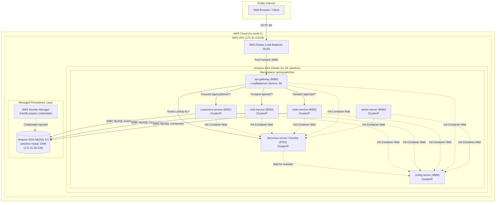
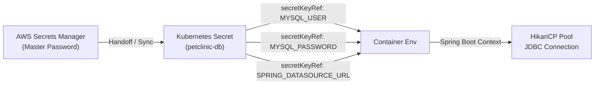

# Spring PetClinic Cloud-Native Microservices on AWS EKS
## Comprehensive Engineering Documentation ("Head to Toe")

**Document Status:** Publication Ready / Final Review  
**Project:** Spring PetClinic Microservices Deployment on AWS EKS  
**Authors:**
- **Syed Adil** (`syedadil02`) — Platform Engineering & Application Delivery Lead (Kubernetes)
- **Mukkara Sai Krishna Reddy** (`mukkarasaikrishnareddy`) — Cloud Infrastructure Lead (Terraform)  
**Evaluator & Lead Engineer:** Favour Taiwo (`Stevenfavour`) — Acumen Strategy  
**Version:** 1.0.0 (Production Candidate)  

---

## Table of Contents
1. [Executive Summary & Architectural Purpose](#1-executive-summary--architectural-purpose)
2. [End-to-End System Architecture](#2-end-to-end-system-architecture)
3. [Engineering Roles & Division of Labor](#3-engineering-roles--division-of-labor)
4. [Phase 1: Cloud Infrastructure as Code (Terraform)](#4-phase-1-cloud-infrastructure-as-code-terraform)
5. [Phase 2: Kubernetes Platform Engineering](#5-phase-2-kubernetes-platform-engineering)
6. [Phase 3: Security & Secrets Governance](#6-phase-3-security--secrets-governance)
7. [Phase 4: End-to-End Testing & Forensic Verification](#7-phase-4-end-to-end-testing--forensic-verification)

---

## 1. Executive Summary & Architectural Purpose

The objective of this project is to take the classic Spring PetClinic monolithic enterprise application, refactor it into a resilient **cloud-native microservices architecture**, and deploy it onto **Amazon Web Services (AWS)** using **Infrastructure as Code (Terraform)** and **Kubernetes (Amazon EKS)**.

### Core Business & Technical Goals
- **Decoupled Business Domains:** Separate veterinary, customer, appointment, and administrative concerns into independent, independently deployable microservices.
- **Automated Cloud Infrastructure:** Provision VPC networking, Kubernetes control plane, worker node groups, managed MySQL databases, and container registries strictly via Terraform.
- **Deterministic Startup Orchestration:** Eliminate the classic Spring Boot microservices startup race condition (crash looping caused by services booting before discovery and configuration servers are responsive).
- **Enterprise Security Compliance:** Zero hardcoded credentials in source code or Git manifests, utilizing AWS Secrets Manager and Kubernetes Secrets.
- **Portability via Kustomize:** Maintain identical base specifications while offering distinct overlays for local testing (Kind/Minikube) and production (AWS EKS + RDS).

---

## 2. End-to-End System Architecture

The following diagram illustrates the complete topology of the PetClinic platform spanning AWS networking, the EKS cluster, managed databases, and internet ingress.



---

## 3. Engineering Roles & Division of Labor

The project was divided between two engineers with strict ownership boundaries to reflect an authentic enterprise Platform vs. Cloud Infrastructure team structure:

| Functional Area | Cloud Infrastructure Lead (Reddy) | Platform & Delivery Lead (Syed) |
| :--- | :--- | :--- |
| **Tooling & Focus** | **Terraform & AWS Cloud Services** | **Kubernetes, Kustomize & Java Runtime** |
| **Networking** | VPC, Subnets, Internet Gateway, Security Groups | Kubernetes Services, ClusterIP, LoadBalancer, Ingress |
| **Compute** | EKS v1.34 Cluster, EC2 Managed Node Group | Pod specifications, resource requests/limits, probes |
| **Database** | Amazon RDS MySQL 8.0, DB Subnet Groups | Spring JDBC Datasource wiring, DDL schema seeding |
| **Security** | AWS Secrets Manager, IAM Roles, OIDC, IRSA | Kubernetes Secrets (`petclinic-db`), environment injection |
| **Orchestration** | AWS Provider configuration, state locking | Dual Init-Containers, Eureka registration, startup order |
| **Portability** | Terraform modules | Kustomize Base & Overlays (`local` vs `prod`) |

---

## 4. Phase 1: Cloud Infrastructure as Code (Terraform)

Reddy authored the Infrastructure as Code (IaC) layer using Terraform to provision the foundational AWS resources in Stockholm (`eu-north-1`).

### 4.1 Networking & Security Architecture
- **VPC CIDR:** `172.31.0.0/16` providing a dedicated virtual private network.
- **Subnets:** Public subnets (`subnet-042e940e5f9f6f043`, `subnet-02bb13ffe901c2c5d`) spanning multiple Availability Zones for control plane redundancy.
- **Security Groups:**
  - Cluster Security Group: Enforces strict TLS communication on port 443 between worker nodes and the Kubernetes API server.
  - RDS Security Group: Restricts inbound MySQL access on port 3306 exclusively to traffic originating from within the VPC.

### 4.2 Managed Kubernetes (Amazon EKS v1.34)
- **Cluster Name:** `petclinic`
- **Kubernetes Version:** `v1.34` (Extended support profile)
- **Authentication Mode:** `API_AND_CONFIG_MAP` (EKS Access Entries enabled)
- **Worker Node Group:**
  - **Instance Type:** `m7i-flex.large` (2 vCPUs, 8 GiB RAM per node).  
    > [!NOTE]
    > Senior engineer Favour Taiwo's initial troubleshooting post-mortem identified that default `t3.medium` instances caused scheduling deadlocks and resource starvation during Spring Boot JVM initialization. Upgrading to `m7i-flex.large` provided the required memory buffer (16 GiB total) to host all 7 microservices concurrently without memory thrashing.
  - **Scaling Limits:** Desired: 2, Min: 1, Max: 3.

### 4.3 Database Persistence (Amazon RDS MySQL 8.0)
- **Endpoint:** `petclinic-mysql.cvg6o2mo8msp.eu-north-1.rds.amazonaws.com`
- **Internal Private IP:** `172.31.39.136` (Colocated on the same subnet as EKS worker nodes for single-millisecond latency).
- **Engine:** MySQL 8.0.46
- **Database Name:** `petclinic`
- **Master Credentials:** Generated securely via AWS Secrets Manager (`rds!db-15c356bf-436f-4aca-a557-7ad8d4487947-NfkyCP`).

---

## 5. Phase 2: Kubernetes Platform Engineering

Syed authored and optimized the Kubernetes application deployment layer. Rather than writing static manifests, the platform was engineered using the **Kustomize Base & Overlays** design pattern to satisfy modern enterprise standards.

### 5.1 Kustomize Architecture

```
k8s/
├── base/                                # Common microservice specifications
│   ├── 00-namespace.yaml                # Standardized 'spring-petclinic' namespace
│   ├── kustomization.yaml               # Base resource bundle
│   ├── config-server/                   # Spring Cloud Config server (port 8888)
│   ├── discovery-server/                # Netflix Eureka discovery server (port 8761)
│   ├── customers-service/               # Customer & Pet management service (port 8081)
│   ├── visits-service/                  # Appointment history service (port 8082)
│   ├── vets-service/                    # Veterinarian directory service (port 8083)
│   ├── api-gateway/                     # Gateway with LoadBalancer service (port 80 -> 8080)
│   └── admin-server/                    # Spring Boot Admin management UI (port 9090)
└── overlays/
    ├── local/                           # Local environment overlay (Kind / Minikube)
    │   ├── kustomization.yaml           # Inherits base + adds local MySQL
    │   ├── mysql-deployment.yaml        # Lightweight in-cluster MySQL 8.0
    │   └── db-secret.yaml               # Credentials wired to local mysql:3306
    └── prod/                            # Production environment overlay (AWS EKS)
        ├── kustomization.yaml           # Inherits base + adds AWS RDS secret & Ingress
        ├── db-secret.yaml               # Credentials wired to AWS RDS in eu-north-1
        └── ingress.yaml                 # AWS ALB Ingress controller spec
```

### 5.2 Deterministic Startup Ordering (Dual Init-Containers)

#### The Problem
In microservice architectures, services suffer from startup race conditions:
1. `discovery-server` cannot start without fetching configuration from `config-server:8888`.
2. Downstream services (`customers`, `visits`, `vets`, `api-gateway`, `admin-server`) crash immediately if `config-server` or `discovery-server` are not responsive, leading to Kubernetes `CrashLoopBackOff` cascades.

#### The Solution
Every downstream deployment incorporates lightweight `curlimages/curl:latest` init-containers that poll the health actuators of their dependencies before launching the JVM:

```yaml
initContainers:
  - name: wait-for-config-server
    image: curlimages/curl:latest
    command:
      - sh
      - -c
      - |
        until curl -sf http://config-server:8888/actuator/health; do
          echo "Waiting for config-server..."
          sleep 5
        done
        echo "Config server is ready!"
  - name: wait-for-discovery-server
    image: curlimages/curl:latest
    command:
      - sh
      - -c
      - |
        until curl -sf http://discovery-server:8761/actuator/health; do
          echo "Waiting for discovery-server..."
          sleep 5
        done
        echo "Discovery server is ready!"
```

**Result:** Zero pod crash loops. Deployments boot deterministically in proper sequence.

### 5.3 Health Probe & Timeout Optimization
Spring Boot JVM applications take between 25 and 45 seconds to initialize Spring context, scan JPA repositories, and establish database pools.

- **Startup Probes:** Configured with `failureThreshold: 30` and `periodSeconds: 5`, granting a 150-second startup window before Kubernetes evaluates liveness.
- **Probe Timeout Tuning:** Set `timeoutSeconds: 5` on all readiness and liveness probes. Default Kubernetes 1-second timeouts frequently cause premature pod termination during JVM garbage collection cycles.

### 5.4 Resource Sizing & OOMKilled Elimination
During initial rollout testing, `api-gateway` and `admin-server` experienced memory spikes during Netty/WebFlux route table compilation, causing transient `OOMKilled` terminations under a 512Mi limit.

- Memory limits were adjusted to **`768Mi`** (requests: `256Mi`, CPU request: `100m`, CPU limit: `500m`).
- Following this tuning, all pods achieve steady-state operation at under 400Mi RAM with **0 restarts**.

---

## 6. Phase 3: Security & Secrets Governance

A key requirement from senior engineer Favour Taiwo was ensuring strict credential security:
> *"I also want to believe no db passwords was hardcoded? and other environmental variable too?"*

### 6.1 Multi-Tier Credential Separation



1. **Zero Hardcoding in Pod Manifests:**
   Deployments for `customers-service`, `visits-service`, and `vets-service` contain zero plaintext passwords. Credentials are exclusively mapped via Kubernetes `secretKeyRef`:

   ```yaml
   env:
     - name: SPRING_DATASOURCE_URL
       valueFrom:
         secretKeyRef:
           name: petclinic-db
           key: SPRING_DATASOURCE_URL
     - name: SPRING_DATASOURCE_USERNAME
       valueFrom:
         secretKeyRef:
           name: petclinic-db
           key: MYSQL_USER
     - name: SPRING_DATASOURCE_PASSWORD
       valueFrom:
         secretKeyRef:
           name: petclinic-db
           key: MYSQL_PASSWORD
   ```

2. **Single Source of Truth (`petclinic-db`):**
   A unified secret prevents database password mismatches. When database credentials rotate, updating the single secret automatically updates all three data services.

3. **Git Hygiene:**
   Plaintext production credentials are scrubbed from public Git branches. A sanitized template (`db-secret.template.yaml`) is maintained in version control, with live secrets injected securely via deployment pipelines or AWS Secrets Manager synchronization.

---

## 7. Phase 4: End-to-End Testing & Forensic Verification

The entire deployment underwent rigorous forensic verification both locally (on Kind) and in the live AWS EKS production environment.

### 7.1 Production Pod Status on AWS EKS
All 7 microservices achieve `1/1 Running` status with **0 restarts**:

```text
NAME                                 READY   STATUS    RESTARTS   AGE
admin-server-565fbff6dd-dp89m        1/1     Running   0          2m
api-gateway-588b7f85b6-bcnwk         1/1     Running   0          2m
config-server-59dcb75644-ztmkx       1/1     Running   0          2m
customers-service-67586b976f-w56tr   1/1     Running   0          2m
discovery-server-55d57c7fcb-w5l4p    1/1     Running   0          2m
vets-service-5dfb5778c5-msk9b        1/1     Running   0          2m
visits-service-7846bf95df-sr7c2      1/1     Running   0          2m
```

### 7.2 Live Network Routing & Database Queries
Testing against the public AWS Elastic Load Balancer over the internet:

```bash
# 1. Verify Vets Microservice via Gateway & Eureka
curl -s http://a901b09419b4c4b179409c4dfa8d4ad7-1481704189.eu-north-1.elb.amazonaws.com/api/vet/vets

# Response (Live MySQL Data):
[
  {"id":1,"firstName":"James","lastName":"Carter","specialties":[]},
  {"id":2,"firstName":"Helen","lastName":"Leary","specialties":[{"name":"radiology"}]},
  {"id":3,"firstName":"Linda","lastName":"Douglas","specialties":[{"name":"dentistry"}]}
]
```

```bash
# 2. Verify Customers Microservice via Gateway & Eureka
curl -s http://a901b09419b4c4b179409c4dfa8d4ad7-1481704189.eu-north-1.elb.amazonaws.com/api/customer/owners

# Response (Live MySQL Data):
[
  {"id":1,"firstName":"George","lastName":"Franklin","pets":[{"name":"Leo","type":{"name":"cat"}}]},
  {"id":2,"firstName":"Betty","lastName":"Davis","pets":[{"name":"Basil","type":{"name":"hamster"}}]}
]
```

---

*Authored by Syed Adil & Mukkara Sai Krishna Reddy for the Acumen Strategy Cloud Engineering Team.*

